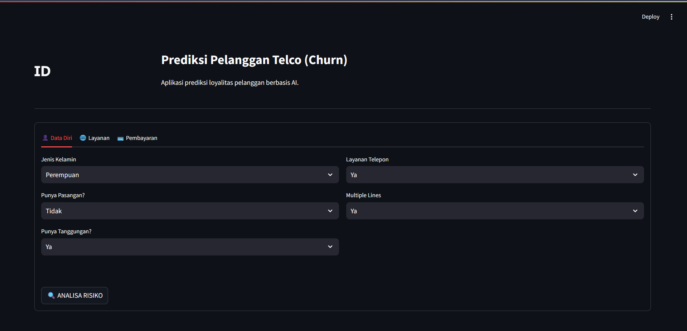
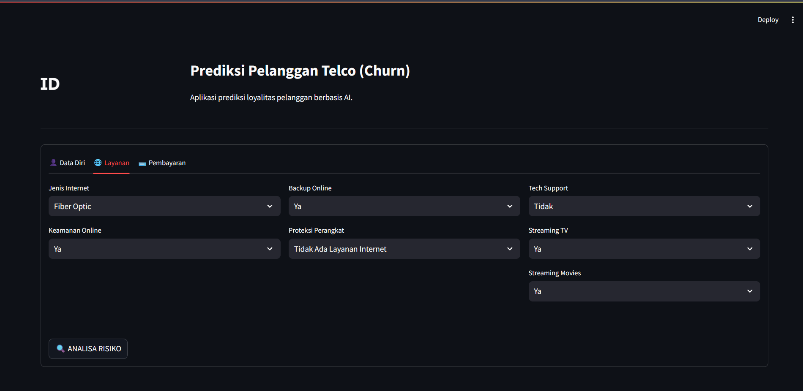
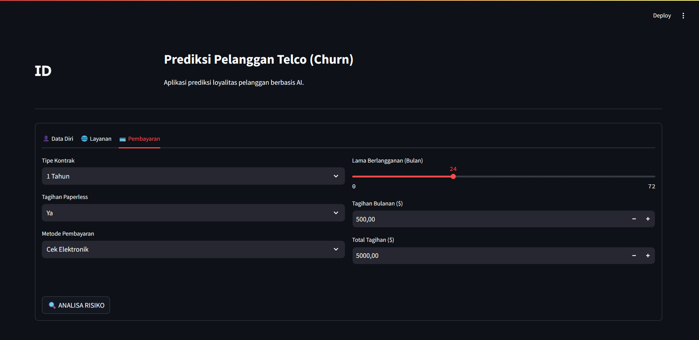

# 📡 Telco Customer Churn Prediction Dashboard

Aplikasi dashboard interaktif untuk memprediksi potensi nasabah berhenti berlangganan (Churn) menggunakan Machine Learning. Proyek ini mendemonstrasikan integrasi antara model AI, antarmuka web yang user-friendly, dan database storage.

## 🖼️ Preview







## ✨ Fitur Unggulan

- **Dual-Language Architecture**:
  - **Frontend**: Menggunakan Bahasa Indonesia agar mudah dipahami user lokal.
  - **Backend**: Melakukan _mapping_ otomatis ke Bahasa Inggris standar sebelum diproses AI dan disimpan ke Database (Menjaga konsistensi data).
- **Real-time Prediction**: Menggunakan algoritma **Random Forest** yang sudah dilatih.
- **Database Recording**: Setiap prediksi disimpan otomatis ke **PostgreSQL** untuk keperluan audit dan monitoring.
- **Risk Meter**: Visualisasi tingkat risiko churn dengan progress bar interaktif.

## 🛠️ Tech Stack

- **Bahasa**: Python 3.9+
- **Frontend**: Streamlit
- **Machine Learning**: Scikit-Learn, Pandas, NumPy
- **Database**: PostgreSQL (psycopg2)
- **Tools**: VS Code, Jupyter Notebook

## 📂 Struktur Project

```text
├── data/               # Dataset (CSV)
├── models/             # File Model (.pkl) & Columns Mapping
├── app.py              # Main Application (Streamlit)
├── database.py         # Modul Koneksi Database
├── requirements.txt    # Daftar Dependencies
└── README.md           # Dokumentasi
```
